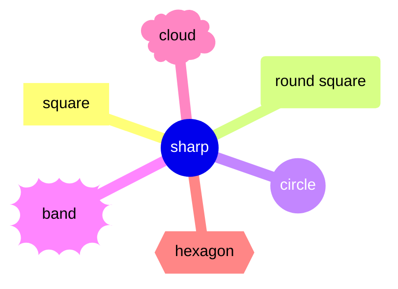
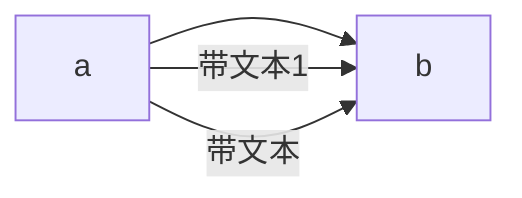
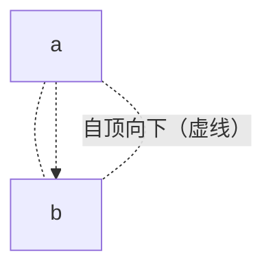
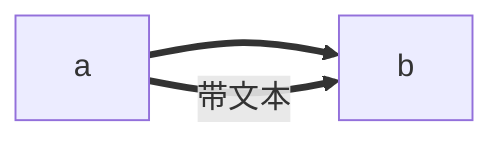
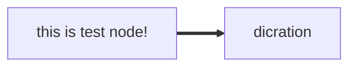
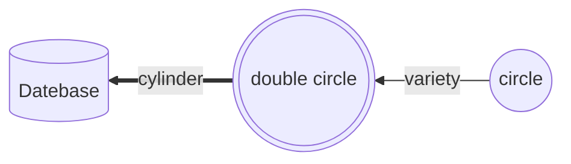
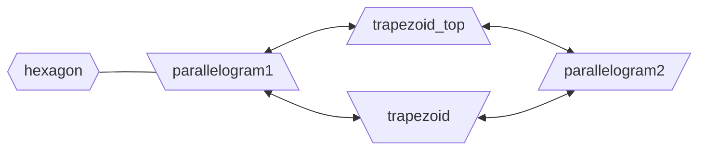
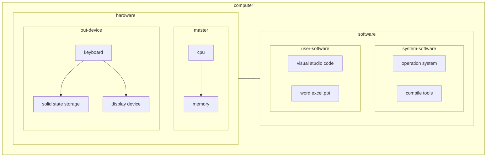

# mermain_learn

## 直线

## 虚线

## 粗线

## 带文本的节点

Node with sharp(Geometry)
~~~mermaid
flowchart LR
    inode7[square]
    inode1(around square)
    inode2([around square2])
    inode3[[sub-programma node]]
    inode1 & inode2 --> inode3 & inode7
~~~

node with sharp2

symmetrical geometry

### subgraph

